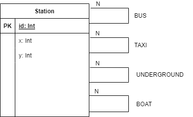
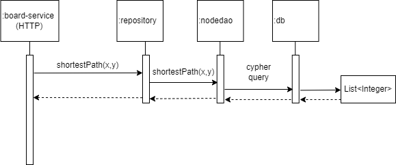

# Architectural Documentation

## 1. Introduction and Goals

This page provides a brief architecture documentation of the 'Faster and Larger - Support for Large Maps' 
extension implementation of the baseline Scotland Yard system. 

### 1.1 Requirements Overview

These are the key functional requirements of the extended system: 

<ol>
    <li>The board-service should define a new service that when given two stations x and y, the 
    shortest path between x and y should be determined.</li>
    <li>The board-service should define a database driven implementation of service <strong>#1</strong>.</li>
    <li>The board-service should define a new service that when given a set of stations and an ordered sequence of 
    transportation means, e.g (TAXI, BUS, UNDERGROUND), all stations that can be reached from the given set of stations, 
    following links according to the given sequence should be determined.</li>
    <li>The board-service should define a database driven implementation of service <strong>#3</strong>.</li>
</ol>

### 1.2 Quality Goals

These are the quality goals of the extended system: 

| Quality Category       | Quality        | Description |
| :---                   | :---:          | ---:        | 
| Performance Efficiency | Time Behaviour | Given a randomly generated board with 50,000 stations, the average execution time for both database driven services should improve by at least 25%.   |
| Performance Efficiency | Time Behaviour | Given a randomly generated board with 50,000 stations, the throughput for requests to the two database driven services should improve by at least 25% | 

### 1.3 Stakeholders

| Role    | Expectations | 
| :---    | ---:         |
| Teacher | The extended system should require only minimal to medium infrastructure support to get up and running. |

## 2. Constraints
 
None.

## 3. Context and Scope

### 3.1 Business Context

### 3.2 Technical Context

In order to run the extended system the board-service needs to be able to 
communicate with a Neo4j database. 
Additionally, the Neo4j installation needs to have the APOC core plugin installed and 
its procedures whitelisted.

## 4. Solution Strategy

This section details the solution strategy: 

<ul>
    <li>The database management system Neo4j is used. 
    Rationale: Neo4j is well suited for the storage of graphs, and the team has past experience using Neo4j.</li>
    <li>The database layer is integrated into the board-service module to keep the extended system aligned with the 
    microservice architecture defined by the base system. 
    Rationale: Microservices are a main topic in the course.</li>
    <li>The database layer is implemented manually. 
    Rationale: To avoid having to modify existing classes.</li>
    <li>The Neo4j 'APOC core' plugin is used to implement the athop function. 
    Rationale: In order to maximise the performance efficiency gain and to meet the related quality goals.</li>
</ul>

## 5. Building Block View

The following UML class diagram shows the classes and methods that have been added to the board-service module.

.png)

Board-service has been extended to provide additional board related services. The following 
endpoints have been added:    

<ul>
    <li>(GET) /shortestPath?x, y:  returns a list of node positions representing the 
    shortest path between two given nodes.</li>
    <li>(GET) /shortestPathNeo4j?x, y:  returns a list of node positions representing the 
    shortest path between two given nodes.</li>
    <li>(GET) /athop?nodes, types:  returns a set of node positions that can be reached 
    from the given nodes following the given sequence of transport types.</li>
    <li>(GET) /athopNeo4j?nodes, types:  returns a set of node positions that can be reached 
    from the given nodes following the given sequence of transport types.</li>
</ul>

The core module also had to be extended in order to facilitate the new services provided by board-service. 
The following methods have been added:     

<ul>
    <li>Board#shortestPath(x, y):  returns a list of node positions representing the shortest 
    path between two given nodes.</li>
    <li>Board#athop(nodes, types):  returns a set of node positions that can be reached from 
    the given nodes following the given sequence of transport types.</li>
</ul> 

The following EER diagram shows the required database-level structure of the board when accessed by an 
instance of the Java class "NodeDao".

## 6. Runtime View

The following UML sequence diagram shows how the database driven, REST webservices in the 
board-service module can be invoked via HTTP by the example of retrieving the shortest path 
between two nodes. 

The (GET) /shortestPathNeo4j endpoint in BoardController invokes the method "shortestPath" on an instance of the Java 
class "BoardRepository", which in turn invokes the method "shortestPath" on an instance of the Java class 
"NodeDao". Finally, the database is queried over the network using the appropriate database drivers, 
and a List representing the shortest path between the two nodes is returned to the user via HTTP. 

## 7. Deployment View

The following UML deployment diagram shows the default deployment to the development environment. 

.png)

Dashed-arrows indicate network links over which communication via HTTP needs to be possible. 
Dotted-arrows indicate network links over which communication via neo4j/bolt needs to be possible. 
Within these constraints, the deployment can be changed via configuration files. 

## 8. Cross-cutting Concerns

### 8.1 Testing

Additional tests targeting the added functionality of the se.kau.cs.sy.board.Board class have been provided. 
Furthermore, the scotland-yard test project has been refactored as a module and is now located inside the 
scotland-yard project.    

Load-test related scripts targeting the board-service module have been added. 
See [load-test-report](board-service/load-test/report.md) for results. 

## 9. Architectural Decisions

|                   |         |
| :---              | :---    | 
| ID                | DEC-101 |
| Decision          | For the database back-end, Neo4j is used. |
| Assumptions       | <ul><li>Any technology used should be free-to-use.</li><li>Any technology used should be well optimized for the modelling and querying of graph based datastructures.</li><li>Any technology used should easily be integrate able into a Spring Boot Application. </li></ul>     |
| Constraints       | None.   |
| Positions         | <ol><li>Use Neo4j.</li><li>Use another graph-based database management system.</li><li>Use any other DMBS.</li></ol>     |
| Argument          | Position 1 appears to be the safest decision due to the fact that the team already have some degree of experience using Neo4j. Neo4j is also well suited for graph based data, and java drivers for the DBMS exist, and it is free to use.  |
| Implications      | The team might have to gain a certain basic understanding of the Cypher query language.    |
| Related Decisions | None.   |

|                   |         |
| :---              | :---    |
| ID                | DEC-102 | 
| Decision          | For the data access layer, the repository and DAO layers are implemented manually.     |
| Assumptions       | <ul></li>Any implementation should seamlessly integrate into the existing Spring Boot Application.</li></ul>     |
| Constraints       | None.   |
| Positions         | <ol><li>Use the library: 'org.neo4j.driver:neo4j-java-driver-spring-boot-starter' and implement the repository and DAO layers manually.</li><li>Use the mapping framework Spring Data Neo4j and have the repository and DAO layers implemented automatically.</li></ol>     |
| Argument          | Position 1 would not require any modification of the scotland-yard module. Position 2 on the other hand would require that the se.kau.cs.sy.board.Board class be modified with annotations and additional methods.     |
| Implications      | The Cypher queries have to be manually written, and so the team must gain a basic understanding of the query language.     |
| Related Decisions | None.   |

## 10. Quality Requirements

None.